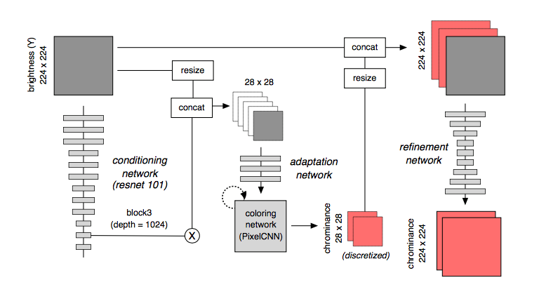

# PixColor Pytorch implementation

paper link: [here](https://arxiv.org/abs/1705.07208)

PixColor is a state-of-the-art colorization method. It is able to produce multiple versions of colored images when given a single black and white image input.
The two main networks require separate training. As you can already infer from the image below, a slight drawback can be that the model is a bit heavy and is trained with the aid of 8(!) GPUs.

***Note
This is not a complete implementation. The coloring network needs to be added.

* There are four main networks included in the architecture

**pix_network_1.py**
1. Conditioning Network:
Pretrain conditioning network on COCO image segmentation

2. Adaptation Network:
Conditioning and adaptation network turn brightness channel Y into a set of features that are used for conditioning the PixelCNN.

3. Coloring Network(pixelCNN):
pixelCNN is optimized alongside conditioning and adaptation network. It predicts a low resolution chrominance of the image

**pix_network_2.py**

4. Refinement Network:
The low resolution color image made from the previous network is fed into the refinement network, which then produces a full resolution colorization

